# ci_cd_pipeline

# Overview

In this project, I have completed the process of Continuous Integration and Continuous Delivery for a machine learning model. 
Here, I have used Github Actions along with a Makefile, requirements.txt and application code to perform an initial lint, test, and install cycle. 
Next, I have integrated this project with Azure Pipelines to enable Continuous Delivery to Azure App Service.
## Project Plan

* Link to a Trello board for the project:- https://trello.com/b/LTELtbvp/building-ci-cd-pipeline
* Link to a spreadsheet that includes the original and final project plan- https://drive.google.com/drive/folders/1lVPWFiWeCpOKcMaGJXZDJzb-NXpPQTpx?usp=sharing

## Instructions

* Architectural Diagram 
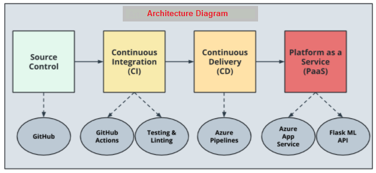

* Project running inside a Docker container
	- First we need to build our Dockerfile to create an image <docker build --tag=flasksklearn .>
	- Once the imgae is created, we can run to create the docker container container <docker run flasksklearn>
	- 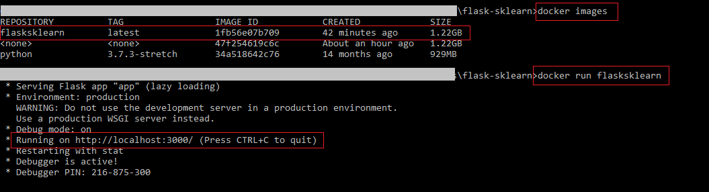

* Project running on Azure App Service
	- To run the application we just need to start the web app named "flask-pred-app" by just clicking the "start" button.
	- Then, the application can be found running at the URL mentioned.
	- 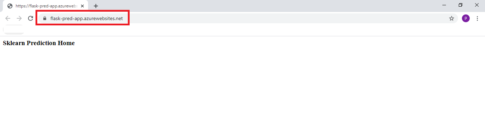

* Project cloned into Azure Cloud Shell
	- First, we need to create a Github repository
	- Next, we need to launch an Azure Cloud Shell environment and integrate Github repository communication using ssh keys
		- To generate key, run <ssh-keygen -t rsa> on az cloud shell and the key can be found at /.ssh/id_rsa.pub
		- Then we need to paste this key to Github repo at SSH and GPG keys options by clicking "New Keys" option.
	- Then we can clone the repo to az clound shell by running <git clone <clone with ssh link for the repo>>
	- 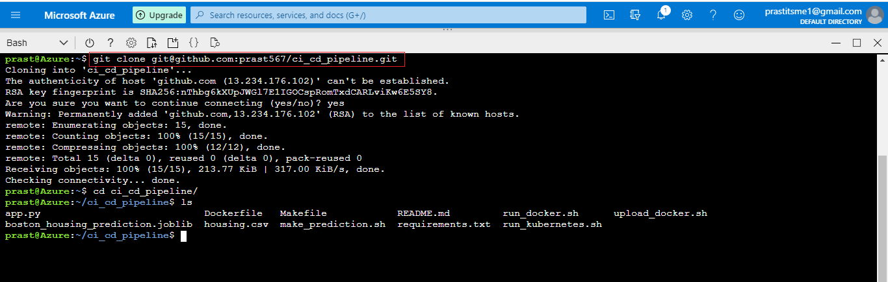

* Passing tests that are displayed after running the `make all` command from the `Makefile`
	- Now, we run the "make all" command to:-
		- install all the dependencies
		- perform linting using pylint
		- perform testing using pytest
	- 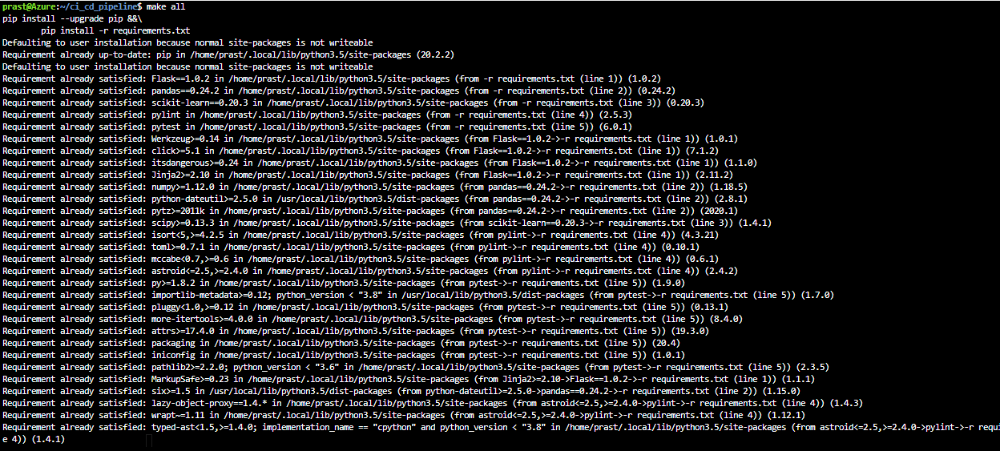
	- 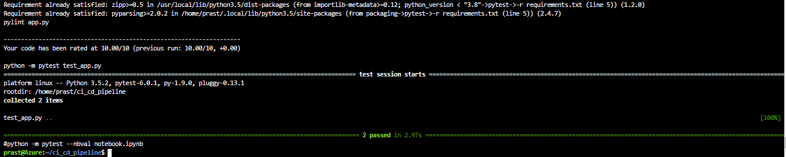

* Output of a test run
	- pytest is used to test the different modules
	- 

* Successful run of the project in Azure Pipelines
	- 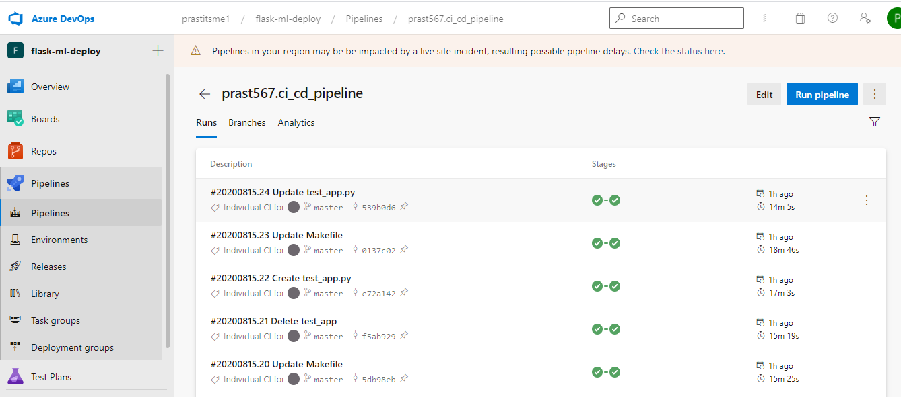

* Running Azure App Service
	- 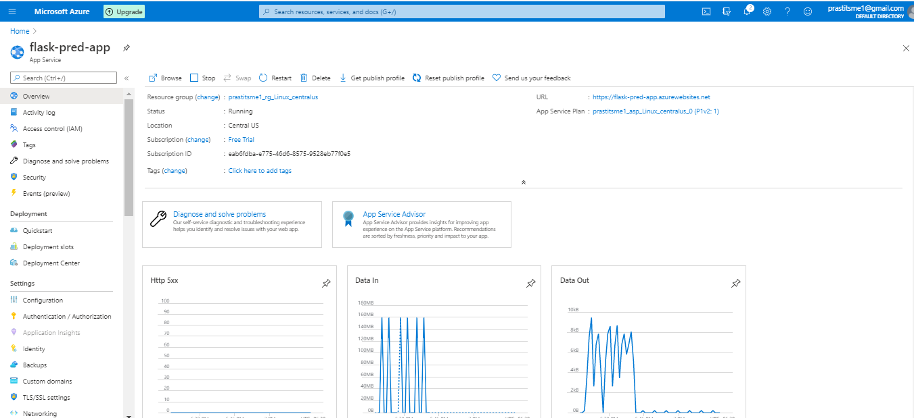
	- 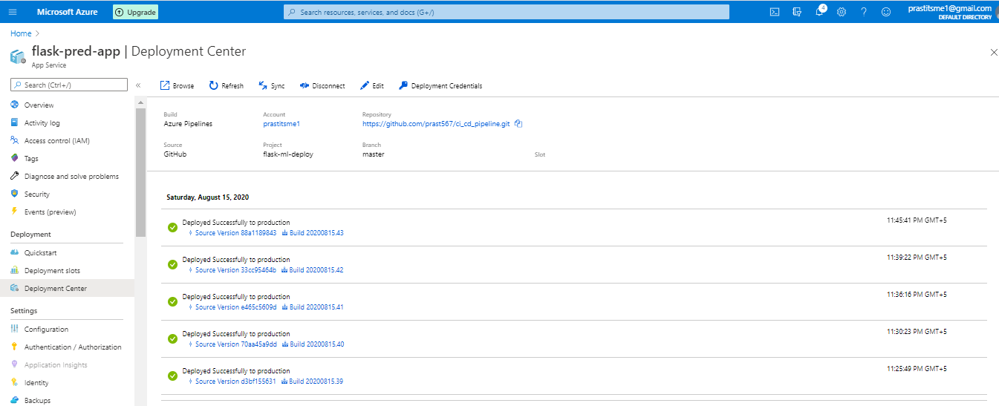

* Successful prediction from deployed flask app in Azure Cloud Shell> 
	- 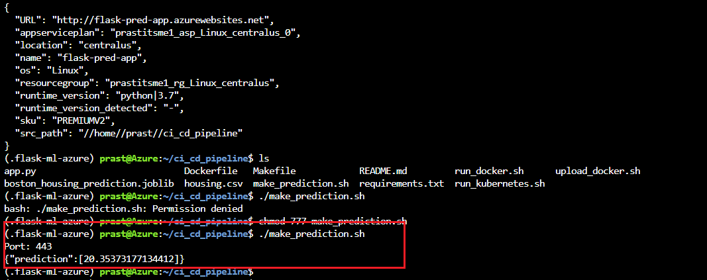
	
* Github badge
	- 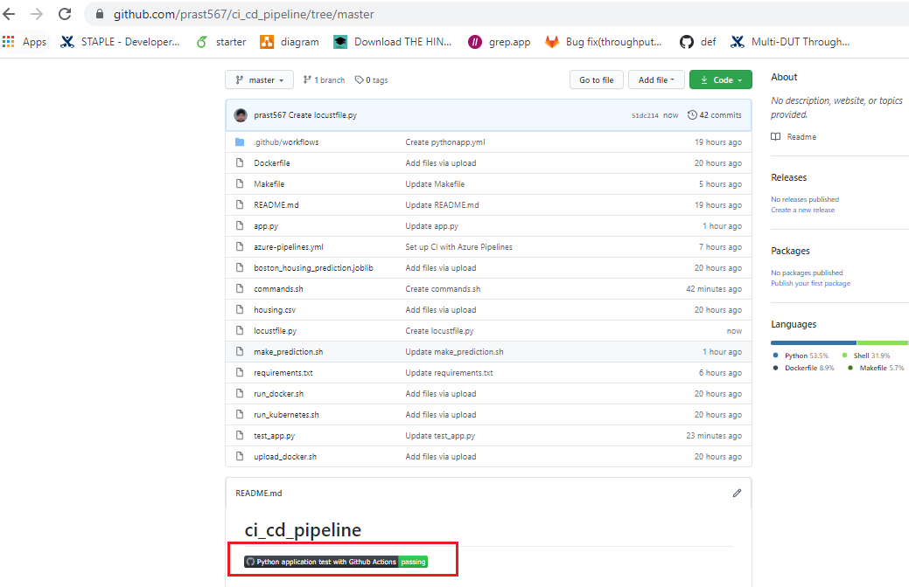

* command.sh shell script
	- 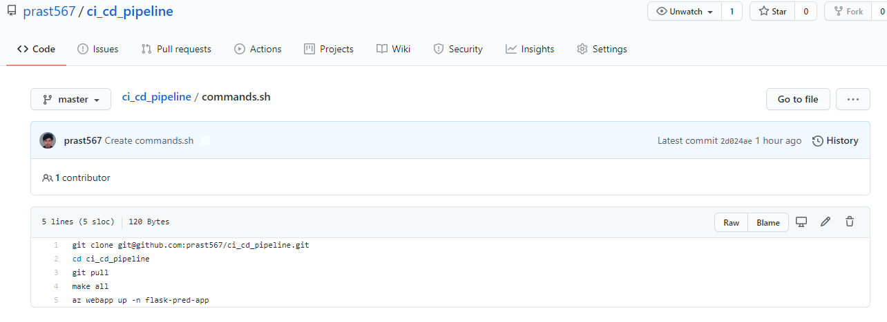
	
* Github yml file
	- 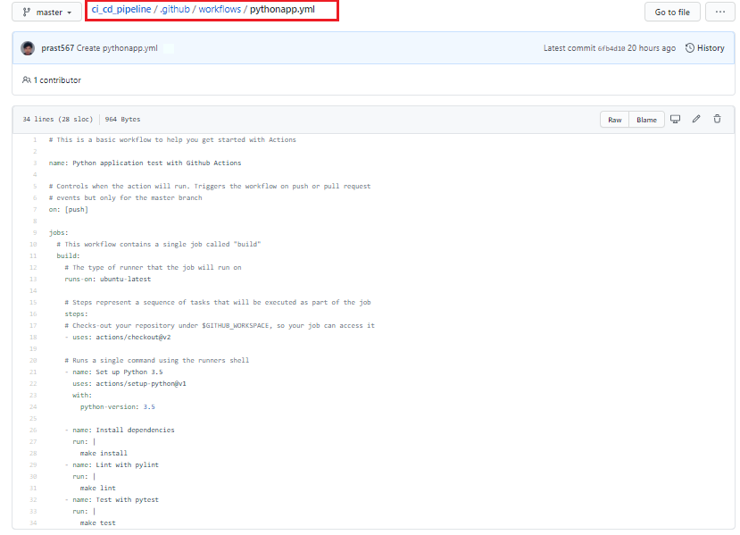
	
* GitHub actions status
	- 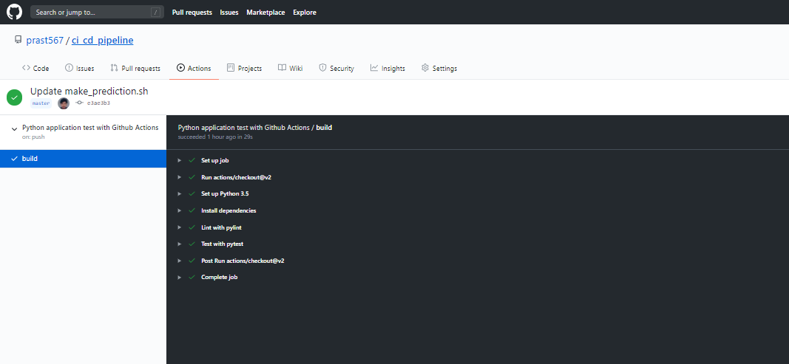

## Enhancements

Currently we are making prediction only for housing price, but the project can be extended to models as well.
This project could be extended to any pre-trained machine learning model, such as those for image recognition and data labeling etc.

## Demo 
Link to screencast on youtube:-
https://www.youtube.com/watch?v=5Mle_CbwYoU&feature=youtu.be

